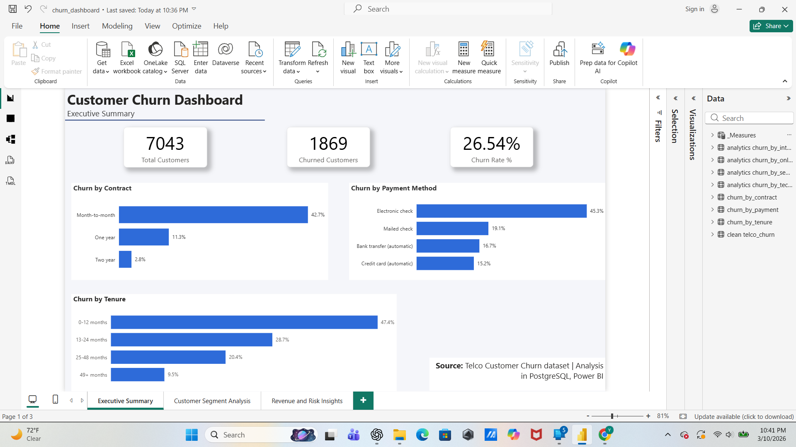
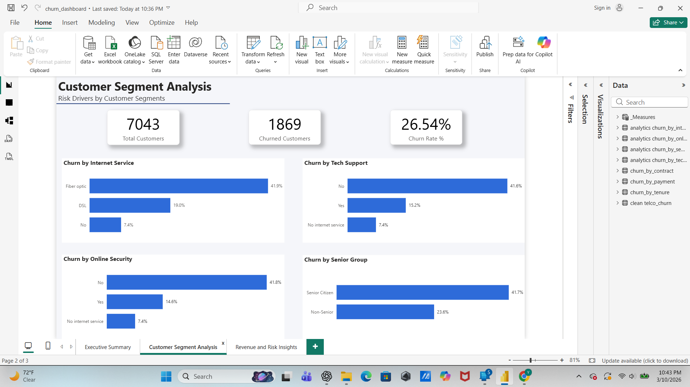
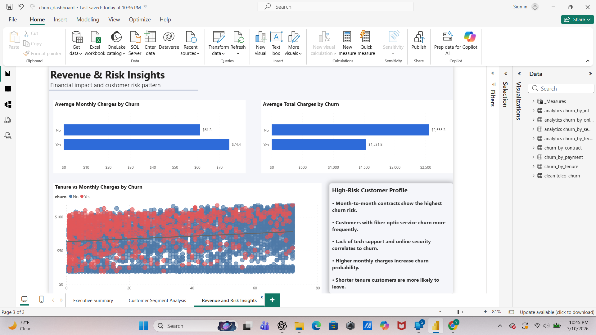

# Telco Customer Churn Analysis - End-to-End Business Analysis

## Power BI Dashboard

### Executive Summary


### Customer Segment Analysis


### Revenue & Risk Insights
# Customer Churn Analysis - END-to-End Data Analytics Project.


## Project Overview

This project analyzes customer churn behavior in a fictitious telecom company using a end-to-end analytics workflow. The goal is to identify key drivers of churn and financial risk patterns by combining SQL analysis, Excel validation, and interactive Power BI dashboards.
The project demostrates a realistic data analyst workflow:

- Data ingestion from Kaggle
- Database storage and schema organization in PostgreSQL
- Data cleaning and transformation using SQL
- Analytical queries and KPI creation
- Data validation in Excel
- Interactive dashboard creation in Power BI

Dataset: Telco Customer Churn Dataset.


## Tools and Technologies

- PostgreSQL (pgAdmin4) - database creation and schema management 
- SQL - data cleaning transformation and analysis
- VS Code - SQL development environment
- Excel - validation and pivot analysis
- Power BI - dashboard visualization


## Dataset Description

The dataset contains telecommunication customer suscription data including:

- Customer demographics
- Contract type
- Internet service type
- Payment method
- Tenure (customer lifecycle)
- Monthly and total charges 
- Additional services (tech support, online security, etc.)
- Customer churn indicator


## Database Setup (PostgreSQL)

The dataset was imported to PostgreSQL using pgAdmin4.

Database schemas were created to organize the data pipeline (raw → clean → analytics).

This structure separates:

- Raw ingested data 
- Clean and standardize data
- Analytical outputs used for dashboards


## SQL Development

SQL scripts were developed in Visual Studio Code using PostgreSQL connections.

The SQL workflow includes:

- 00_test_connection.sql
- 01_exploration.sql
- 02_clean_data.sql
- 03_validation.sql
- 04_churn_analysis.sql
- 05_excel_exports.sql

## Data Cleaning: 

The raw dataset was cleaned and standardize using SQL.

Key Transformations:

- Trimming text fields
- Converting numeric columns
- Standardizing categorical values
- Creating binary churn indicator
 
Example:

```
CASE
    WHEN BTRIM(churn) = 'Yes' THEN 1 
    ELSE 0 
END AS churn_flag
```

- Additional feature engineering: tenure_cohort, used to group customers by lifecycle stage.

## Analytical Views:

SQL views were created in the analytics schema to support reporting and dashboards. 

Example:

- analytics.churn_kpis
- analytics.churn_by_contract
- analytics.churn_by_tenure
- analytics.churn_by_payment


## Excel Validation

SQL outputs were exported to CSV files and analyzed in Excel.

Purpose:

- Validate metrics
- Perform pivot table analysis
- Prepare aggregated datasets for reporting


## Power BI Dashboard

Power BI was used to build a 3-page interactive churn analysis dashboard.

1. Executive Summary
2. Customer Segment Analysis
3. Revenue and Risk Insights


## Folder Structure

```
telco-churn-cohort-analysis/
│
├── data/
│   ├── 01_raw/
│   │   └── telco_churn_raw.csv
│   │
│   ├── 02_sql/
│   │   ├── 00_test_connection.sql
│   │   ├── 01_exploration.sql
│   │   ├── 02_clean_data.sql
│   │   ├── 03_validation.sql
│   │   ├── 04_churn_analysis.sql
│   │   └── 05_excel_exports.sql
│   │
│   ├── 03_excel/
│   │   ├── 01_churn_kpis.csv
│   │   ├── 02_churn_by_contract.csv
│   │   ├── 03_churn_by_tenure.csv
│   │   ├── 04_churn_by_payment.csv
│   │   └── churn_analysis.xlsx
│   │
│   ├── 04_powerbi/
│   │   └── churn_dashboard.pbix
│   │
│   └── 05_images/
│       ├── 01_executive_summary.png
│       ├── 02_customer_segment_analysis.png
│       ├── 03_revenue_and_risk_insights.png
│
└── README.md
```


## Business Insights

- Month-to-month contracts show the highest churn risk 
- Customers with fiber optic internet churn more frequently
- Lack of tech support and online security correlates strongly with churn
- Customers with higher monthly charges are more likely to churn
- Short-tenure customers are the most vulnerable segment


## Business Recommendations

1. Encourage longer-term contracts through incentives
2. Improve early lifecycle customer experience
3. Promote tech support and security add-ons
4. Monitor high-price plans for churn risk


## Project Highlights

This project demonstrates the ability to:

- Build SQL analytics pipelines
- Perform data cleaning and validation
- Create analytical views for reporting
- Connect SQL outputs to Excel and Power BI
- Design professional dashboards
- Communicate business insights clearly


## Author
Yorman Gomez 

Data Analytics Portfolio Project